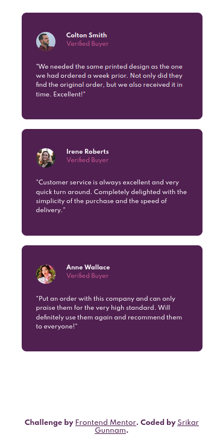
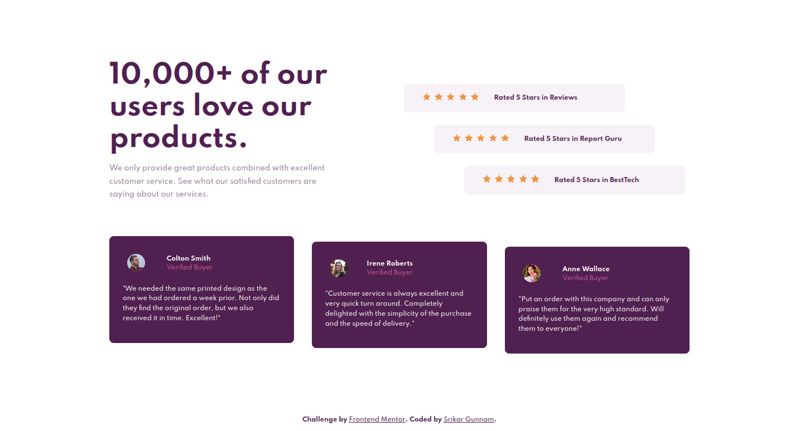

# Frontend Mentor - Social proof section solution

This is a solution to the [Social proof section challenge on Frontend Mentor](https://www.frontendmentor.io/challenges/social-proof-section-6e0qTv_bA). Frontend Mentor challenges help you improve your coding skills by building realistic projects. 

## Table of contents

  - [Overview](#overview)
    - [The challenge](#the-challenge)
    - [Screenshot](#screenshot)
    - [Links](#links)
  - [My process](#my-process)
    - [Built with](#built-with)
    - [What I learned](#what-i-learned)
    - [Continued development](#continued-development)
    - [Useful resources](#useful-resources)
  - [Author](#author)

## Overview

### The challenge

Users should be able to:

- View the optimal layout for the section depending on their device's screen size

### Screenshot

#### Mobile Preview
 

#### Desktop Preview

### Links

- [Solution](https://github.com/srikargunnam/frontendmentor-social-proof-section-master)
- [Live site](https://srikargunnam.github.io/frontendmentor-social-proof-section-master/)

## My process

### Built with

- Semantic HTML5 markup
- CSS & Sass
- Flexbox
- CSS Grid
- Mobile-first workflow

### What I learned

I generally prefer to use _position: absolute and top, bottom properties_ to center the main div, but this project helped me understand that even _flex_ can be better used to do the same process in a better way, but it really depends on the perspective of the user.

### Continued development

I would try to implement those techniques which i felt could replace what i used earlier for similar purpose.

### Useful resources

- [MDN](https://developer.mozilla.org/en-US/docs/Web/CSS) - This is the best place where you can understand the usage of CSS properties very well, i found this as a very helpful resourse
- [1 Line Layouts](https://1linelayouts.glitch.me/) - This is an amazing website, where you can find the 10 Modern CSS layout and sizing techniques.

## Author

- Website - [srikargunnam.com](https://srikargunnam.com) 	🕸
- Frontend Mentor - [@srikargunnam](https://www.frontendmentor.io/profile/srikargunnam)
- Twitter - [@SrikarGunnam](https://twitter.com/SrikarGunnam)
- Codepen - [@srikargunnam](https://codepen.io/srikargunnam)
- GitHub - [@srikargunnam](https://github.com/srikargunnam/)

